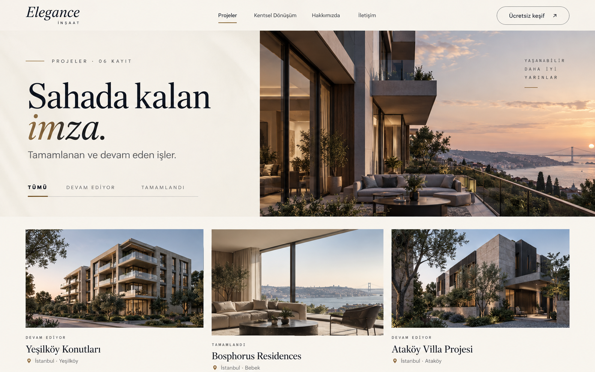

# Elegance Alt Sayfalar — Yeniden Tasarım Uygulama Planı

## 1. Hedef

Ana sayfadaki rafine, mimari ve editoryal karakteri koruyarak alt sayfaları daha düzenli, daha görsel ve daha kısa hale getirmek. Tasarımın ana hissi **“sessiz mimari / editoryal konut markası”** olacak: güçlü fotoğraf, net tipografi, az sayıda dekoratif öğe ve her ekranda belirgin bir sonraki adım.

Bu çalışma ana sayfayı yeniden tasarlamaz. Ana sayfa, alt sayfalar için kalite ve marka referansıdır.

## 2. Mevcut Durumdan Çıkan Sorunlar

### P0 — Sistem sorunları

1. `PageHeader` tüm alt sayfalara aynı blueprint zeminini, aynı iki kolonlu düzeni ve benzer yüksekliği uyguluyor. Sayfalar içerikleri farklı olsa da aynı şablonun kopyası gibi görünüyor.
2. Alt sayfa header'ı aynı anda logo, beş navigasyon öğesi, mega menü, çalışma durumu ve telefon numarası taşıyor. İlk bakışta marka yerine navigasyon yoğunluğu hissediliyor.
3. Büyük `py-20 / lg:py-28` boşlukları her bölümde aynı kullanılıyor. İçerik önceliği oluşmadığı için sayfalar uzun ve tek ritimli.
4. Blueprint, köşe işaretleri, çerçeveli “sheet” yüzeyleri, koyu bilgi kutuları, büyük ghost yazılar ve sepia filtreleri aynı anda tekrar ediyor. Tek tek markaya uygun olan bu öğeler birlikte kullanıldığında gereksiz görsel gürültü yaratıyor.

### P1 — İçerik ve sayfa akışı sorunları

1. Hakkımızda sayfasında aynı istatistikler iki ayrı koyu bölümde tekrar ediliyor.
2. Bölge detayında `landmarks` hem konum bölümünde hem koyu özet kutusunda tekrar gösteriliyor.
3. Hizmet detayında hero CTA'ları, içerik içi CTA ve final CTA aynı mesajı tekrarlıyor.
4. Her detay sayfasına “diğer hizmetler / yakın bölgeler / diğer projeler” eklenmesi ana içeriğin kapanışını geciktiriyor.
5. Projeler sayfasında filtreler ve proje görselleri, büyük hero ile ikinci büyük boşluk nedeniyle ilk ekranda yeterince görünmüyor.
6. Proje ve hizmet fotoğraflarındaki sürekli sepia/overlay kullanımı gerçek proje algısını zayıflatıyor; görseller kanıt olmaktan çıkıp dekorasyona dönüşüyor.

### Ekran görüntüsü notu

Ekran Alıntısı Aracı bildirimi ve sağ alt köşedeki sistem paneli site arayüzünün parçası değildir; tasarım değerlendirmesine dahil edilmemiştir.

## 3. Tasarım Yönü

### Görsel ilke

- Fotoğraf önce, dekorasyon sonra.
- Bir ekranda en fazla bir baskın görsel motif.
- Blueprint sadece süreç/teknik içerikte, küçük ve kontrollü bir yüzeyde kullanılabilir; genel sayfa arka planı olmayacak.
- Köşe işaretleri standart kart dekorasyonu olmaktan çıkarılacak; yalnızca teknik çizim veya galeri detayı gibi anlamlı yerlerde kullanılacak.
- Tüm kartların çerçeveli olması yerine boşluk, hizalama ve ince ayraçlarla hiyerarşi kurulacak.
- Proje fotoğrafları doğal renkleriyle gösterilecek. Hover efektleri ölçek + çok hafif kontrast değişimiyle sınırlı kalacak.

### Renk

Mevcut marka paleti korunur ancak kullanım oranı sadeleştirilir:

- `%70` sıcak ivory / limestone yüzeyler
- `%20` gece laciverti veya mevcut `ink`
- `%10` muted brass vurgu

Brass büyük blok dolgusu değil; aktif durum, ince çizgi, küçük etiket ve kritik CTA vurgusu olarak kullanılmalı.

### Tipografi

- Fraunces başlık karakteri korunur.
- İtalik vurgu her başlıkta değil, yalnızca sayfa başına bir defa kullanılır.
- Masaüstü alt sayfa H1: `clamp(3.5rem, 5.8vw, 6.5rem)`.
- Gövde metni: en fazla `65ch`, varsayılan `16–18px`, satır yüksekliği `1.65–1.75`.
- Eyebrow/etiketler yalnızca yön bulma ve metadata için kullanılır; dekoratif tekrar olmamalı.

### Boşluk sistemi

- Header: `76–80px`
- Hero: liste sayfalarında `480–560px`, detaylarda görsele göre `min(72svh, 760px)`
- Ana section dikey boşluğu: masaüstü `88–104px`, mobil `56–72px`
- Ardışık, hafif içerikli iki bölüm varsa ayrı section yerine aynı bölüm içinde alt grup kullanılmalı.

## 4. Yeni Ortak Sayfa İskeleti

```text
Slim Header
└─ Subpage Hero
   ├─ bağlam / breadcrumb
   ├─ tek güçlü başlık
   ├─ kısa açıklama veya temel veri
   └─ sayfaya özgü görsel / harita / CTA
Main Story / Primary Content
Proof / Projects / Gallery
Compact Conversion Band
Footer
```

Her rota bu omurgayı kullanır fakat hero içeriği sayfa türüne göre değişir. Tek bir katı `PageHeader` yerine üç açık varyant kullanılmalı:

- `listing`: hizmetler, projeler, bölgeler
- `detail`: hizmet, proje ve bölge detayları
- `contact`: iletişim

## 5. Rota Bazlı Yeni Bilgi Mimarisi

### `/projeler`

1. Split hero: solda başlık + kısa açıklama + filtreler, sağda güçlü bir proje fotoğrafı.
2. Proje listesi hero'nun hemen altında başlamalı; ilk satır ilk viewport içinde kısmen görünmeli.
3. Desktop: 12 kolon üzerinde 7/5 veya 5/7 ritimli, fakat düzgün baseline'a sahip proje kartları.
4. Kartta sadece durum, proje adı, bölge, tip ve yıl gösterilmeli.
5. Sayfa sonunda tek kompakt keşif CTA'sı.

Kaldırılacaklar: blueprint hero zemini, her karttaki köşe işaretleri, sabit sepia katmanı, filtrelerden önceki büyük boşluk.

### `/projeler/[slug]`

1. Görsel ağırlıklı hero: proje adı, konum, hizmet, yıl ve durum fotoğrafın üzerinde veya yanında.
2. “Proje hikâyesi” ile “proje künyesi” aynı ilk içerik bölümünde birleşir.
3. Galeri ana kanıt alanıdır; önce/sonra varsa galeri akışının özel bir modülü olarak gösterilir.
4. Timeline sadece gerçek ve anlamlı veri olduğunda kalır; boş/genel metinlerle doldurulmaz.
5. En fazla iki ilgili proje + tek final CTA.

Kaldırılacaklar: hero içindeki iki ayrı CTA, bağımsız ve tekrarlayan “Devamı” bölümü, gereksiz bölüm numarası dekorasyonu.

### `/hizmetler`

1. Hero: hizmet vaadi + öne çıkan hizmete ait güçlü fotoğraf.
2. Kentsel dönüşüm tek büyük “featured service” bloğu olarak kalır.
3. Diğer hizmetler görselsiz ama tipografik, kolay taranan satırlar halinde sunulur.
4. Tek “nasıl çalışırız” kanıt şeridi ve final CTA.

Kaldırılacaklar: her hizmeti aynı büyüklükte görsel karta çeviren tekrar, gereksiz kart çerçeveleri.

### `/hizmetler/[slug]`

1. Hero: hizmet adı, tek cümle değer önerisi, bir ana CTA ve doğal renkli saha görseli.
2. Hizmet kapsamı + açıklama tek bölümde, sticky özet ile verilir.
3. Varsa hizmete özgü süreç veya önce/sonra kanıtı.
4. En fazla üç ilgili proje.
5. Final CTA.

Kaldırılacaklar: hero'daki ikinci CTA, sayfa ortası ek CTA, uzun “diğer hizmetler” listesi. Diğer hizmetler footer öncesinde 2–3 küçük metin linki olabilir.

### `/bolgeler`

1. Harita, hero'nun görsel odağı olmalı; metin ve lokasyon listesi aynı kompozisyonda yer almalı.
2. Bölge satırlarında sadece ad, kısa uzmanlık cümlesi ve proje sayısı gösterilmeli.
3. Hover/focus durumunda harita üzerindeki ilgili nokta vurgulanmalı.
4. Tek keşif CTA'sı.

### `/bolgeler/[slug]`

1. Hero: bölge adı + yerel değer önerisi + harita veya o bölgeyi temsil eden gerçek proje görseli.
2. “Konum” ve “yaklaşımımız” tek bölümde birleşmeli.
3. Landmarks bir kez gösterilmeli.
4. Bu bölgedeki projeler ana kanıt alanı olmalı.
5. Yakın bölgeler, büyük ayrı section yerine ince bir link şeridi olmalı.

### `/hakkimizda`

1. Ekip/şantiye fotoğraflı, insan odaklı hero.
2. Kısa hikâye + tek istatistik şeridi.
3. Dört çalışma ilkesi.
4. Dört adımlı süreç.
5. Final CTA.

Kaldırılacaklar: ikinci istatistik bölümü, hikâye ile görsel arasındaki kopukluk, aynı koyu blueprint yüzeyinin tekrarı.

### `/iletisim`

1. İletişim hero'su doğrudan telefon + WhatsApp aksiyonlarını taşımalı.
2. Adres, çalışma saatleri ve harita ikinci ve son ana bölümde olmalı.
3. Hazır WhatsApp konuları accordion veya küçük seçim listesi olarak tek noktada kalabilir.
4. Ek koyu “hemen başlayın” kartı kaldırılmalı; sayfa zaten dönüşüm sayfasıdır.

## 6. Bileşen Planı

### Yenilenecek

- `src/components/Header.tsx`
  - Ana/alt sayfa için tamamen ayrı görsel sistem yerine ortak ölçü ve navigasyon dili.
  - Desktop mega menü sadeleştirilmeli; servis açıklamaları ve öne çıkan proje kartı menüden çıkarılmalı.
  - Çalışma durumu telefon alanından ayrılmamalı; küçük bir nokta ve kısa metin yeterli.
- `src/components/PageHeader.tsx`
  - Yerine veya üzerine `SubpageHero` API'si kurulmalı.
  - `variant`, `media`, `meta`, `actions`, `filters` slotları desteklenmeli.
- `src/components/ProjectCard.tsx`
  - Frame/sepia/köşe dekorasyonu azaltılmalı.
  - Kart görsel oranı sayfa bağlamına göre değişebilmeli.
- `src/components/CtaBand.tsx`
  - Yükseklik ve ghost wordmark azaltılmalı; tek başlık, telefon ve WhatsApp yeterli.
- `src/components/Footer.tsx`
  - Ghost wordmark ve fazla link tekrarları sadeleştirilmeli; hizmet/bölge linkleri iki kompakt kolonda tutulmalı.

### Yeni ortak parçalar

- `src/components/subpages/SubpageHero.tsx`
- `src/components/subpages/SectionIntro.tsx`
- `src/components/subpages/ProofStrip.tsx`
- `src/components/subpages/RelatedLinks.tsx`
- `src/components/subpages/MediaFrame.tsx`

Yeni parçalar yalnızca gerçek tekrar varsa oluşturulmalı. Tek rotaya özel görsel düzenler sayfa dosyasında kalabilir.

### Tasarım tokenları

`src/app/globals.css` içinde:

- container: `--page-max: 1280px`
- yatay gutter: `--page-gutter`
- header yüksekliği: `--header-h`
- section spacing: `--section-y`
- metin ölçüsü: `--measure`
- radius kullanılmayacaksa global bir “kart radius” sistemi eklenmemeli.

## 7. Dosya Bazlı Uygulama Sırası

### Faz 0 — Baseline ve içerik kararı (0.5 gün)

- Mevcut tüm rotaların 1440px ve 390px ekran görüntülerini sabitle.
- Her sayfa için korunacak/kaldırılacak bölüm listesini onayla.
- Gerçek proje fotoğrafları ile temsili görselleri veri modelinde ayır.

### Faz 1 — Tasarım temeli (1–1.5 gün)

- `src/app/globals.css`
- `src/components/Header.tsx`
- `src/components/subpages/SubpageHero.tsx`
- `src/components/CtaBand.tsx`
- `src/components/Footer.tsx`

Bu faz sonunda yalnızca ortak kabuk tamamlanmış olmalı; tüm rotalar henüz yeniden düzenlenmiş olmak zorunda değil.

### Faz 2 — Liste sayfaları (1 gün)

- `src/app/projeler/page.tsx`
- `src/components/ProjectsGrid.tsx`
- `src/components/ProjectCard.tsx`
- `src/app/hizmetler/page.tsx`
- `src/app/bolgeler/page.tsx`

Önce `/projeler` tamamlanmalı; diğer iki liste sayfası aynı sistemin sağlamasını yapar.

### Faz 3 — Detay şablonları (1.5–2 gün)

- `src/app/projeler/[slug]/page.tsx`
- `src/app/hizmetler/[slug]/page.tsx`
- `src/app/bolgeler/[slug]/page.tsx`
- `src/components/Gallery.tsx`
- `src/components/Timeline.tsx`
- `src/components/BeforeAfter.tsx`
- `src/components/AreaMap.tsx`

### Faz 4 — Kurumsal ve dönüşüm sayfaları (0.5–1 gün)

- `src/app/hakkimizda/page.tsx`
- `src/app/iletisim/page.tsx`

### Faz 5 — QA ve polish (0.5–1 gün)

- 390 / 768 / 1024 / 1440 genişliklerinde görsel kontrol.
- Klavye navigasyonu, focus, kontrast ve motion-reduce kontrolü.
- Header menüsü ve tüm CTA'lar için etkileşim testi.
- LCP görsellerinde `priority`, doğru `sizes` ve mobil kırpım kontrolü.
- `npm run lint` ve `npm run build`.

Tahmini toplam: **5–6 iş günü**.

## 8. Kabul Kriterleri

1. Alt sayfa header'ı masaüstünde 80px'i geçmez; mobilde tek satırlı ve 72–76px aralığındadır.
2. Liste sayfalarında ana içerik veya ilk kart 900px yüksekliğindeki viewport içinde görünür.
3. Hiçbir sayfada aynı veri/mesaj iki ayrı bölümde tekrarlanmaz.
4. Bir sayfada en fazla bir büyük blueprint yüzeyi bulunur; liste sayfalarında hiç kullanılmaz.
5. Proje görsellerinde varsayılan sepia filtresi yoktur.
6. Her sayfada bir ana CTA ve en fazla bir destek CTA vardır.
7. Mobilde yatay taşma yoktur; butonlar en az 44px dokunma alanına sahiptir.
8. `prefers-reduced-motion` durumunda içerik gizli kalmaz ve geçişler devre dışı olur.
9. Proje, hizmet ve bölge detay şablonları aynı tasarım sistemine ait görünür; fakat içerik türleri birbirinden ayırt edilebilir.
10. `npm run lint` ve `npm run build` hatasız tamamlanır.

## 9. Görsel Referans



Bu görsel birebir kopyalanacak nihai tasarım değildir. Şunları sabitleyen bir yön referansıdır:

- ince ve sakin header,
- split hero,
- fotoğraf merkezli anlatım,
- filtrelerin hero'ya bağlanması,
- daha az çerçeve ve dekorasyon,
- ana içeriğin ilk viewport'a yaklaşması.

## 10. Uygulayıcı Model İçin Kısa Brief

> Ana sayfanın mevcut tasarım kalitesini ve Fraunces + Archivo tipografi sistemini koru. Alt sayfaları “sessiz mimari / editoryal konut markası” yönünde yeniden düzenle. Önce ortak header, SubpageHero varyantları, spacing tokenları ve sade CTA bandını oluştur; sonra projeler liste sayfasını referans uygulama olarak tamamla. Blueprint, corner ticks, sepia filtre, büyük ghost wordmark ve aynı CTA'nın tekrarını azalt. İçeriği silmeden önce rota bazlı plandaki birleştirme kurallarını uygula. Mevcut SEO metadata, JSON-LD, veri modelleri ve erişilebilirlik davranışlarını koru. Next.js 16.3.4 için kod yazmadan önce `node_modules/next/dist/docs/` altındaki ilgili güncel rehberleri oku. Her fazdan sonra lint/build çalıştır ve 390px ile 1440px ekran görüntüsü al.
